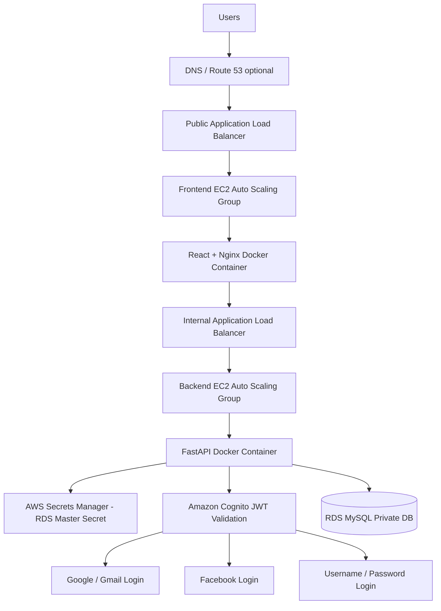
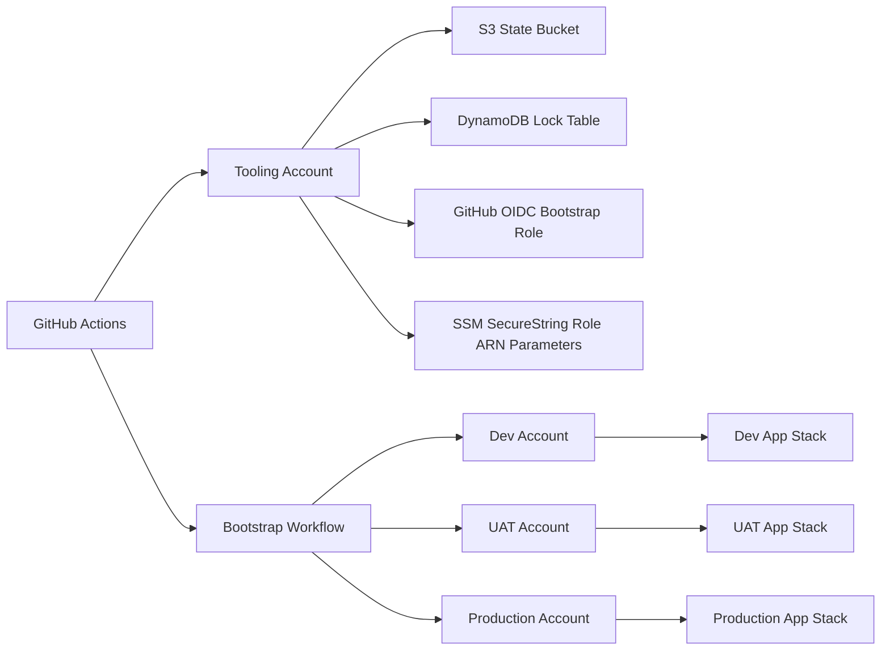
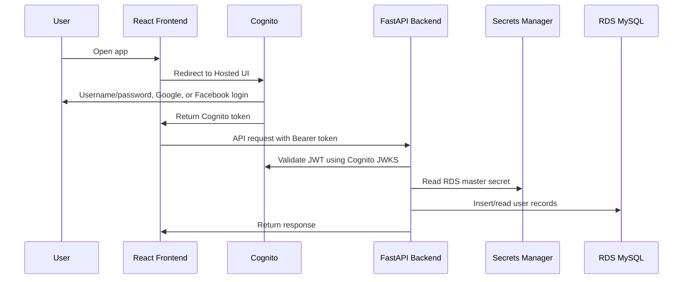

# AWS Multi-Account 3-Tier Application

This repository deploys a production-style AWS 3-tier application with a React frontend, Python FastAPI backend, and Amazon RDS MySQL database. It supports separate AWS accounts for dev, uat, and production, centralized Terraform state in a tooling account, GitHub Actions CI/CD, KMS encryption, RDS-managed Secrets Manager database password, and Amazon Cognito authentication with username/password plus Google and Facebook social login.

## Architecture Diagram



## Multi-Account Deployment Flow



## Application Request Flow



## Repository Structure

```text
frontend/                         React frontend served by Nginx
backend/                          FastAPI backend
terraform/tooling/                Tooling account foundation stack
terraform/bootstrap/              Multi-account bootstrap stack
terraform/environments/dev/       Dev app stack
terraform/environments/uat/       UAT app stack
terraform/environments/production/ Production app stack
terraform/modules/                Reusable Terraform modules
.github/workflows/                GitHub Actions workflows
```

## Authentication Design

The application uses Amazon Cognito User Pool with three login options:

- Username/password account created in the application
- Existing Google/Gmail account
- Existing Facebook account

React redirects users to Cognito Hosted UI. Cognito handles user registration, password reset, email verification, and social login. FastAPI validates Cognito-issued JWT tokens and creates or updates user profiles in MySQL.

## Database Password Design

The RDS MySQL password is not stored in GitHub and is not provided by Terraform variables. RDS creates and manages the master password automatically using:

```hcl
manage_master_user_password   = true
master_user_secret_kms_key_id = var.kms_key_arn
```

The backend EC2 role reads the generated secret from AWS Secrets Manager at runtime.

## Deployment Order

### 1. Run Tooling Foundation Workflow

This creates the shared foundation in the tooling account:

- S3 Terraform state bucket
- DynamoDB lock table
- KMS key for state encryption
- GitHub OIDC provider
- GitHub bootstrap role

Use temporary tooling credentials only for the first tooling workflow run.

### 2. Run Bootstrap Multi-Account Workflow

This creates per-environment resources:

- Dev/UAT/Production deploy roles
- ECR repositories in each target account
- SSM SecureString parameters in the tooling account containing deploy role ARNs

### 3. Run App Deploy Workflow

The app workflow maps branches to environments:

| Branch | Environment | AWS Account |
|---|---|---|
| `develop` | dev | `DEV_ACCOUNT_ID` |
| `uat` | uat | `UAT_ACCOUNT_ID` |
| `main` | production | `PRODUCTION_ACCOUNT_ID` |

Production includes a GitHub Environment approval gate before Terraform apply.

## Required GitHub Variables

```text
AWS_REGION
PROJECT_NAME
GITHUB_ORG
GITHUB_REPO
TOOLING_ACCOUNT_ID
DEV_ACCOUNT_ID
UAT_ACCOUNT_ID
PRODUCTION_ACCOUNT_ID
BOOTSTRAP_ROLE_ARN
DEV_BOOTSTRAP_ROLE_ARN
UAT_BOOTSTRAP_ROLE_ARN
PRODUCTION_BOOTSTRAP_ROLE_ARN
TF_STATE_BUCKET
TF_LOCK_TABLE
TF_STATE_KMS_KEY_ID
TF_STATE_KMS_KEY_ARN
FRONTEND_REPOSITORY_NAME
BACKEND_REPOSITORY_NAME
TERRAFORM_VERSION
COGNITO_DOMAIN
COGNITO_CLIENT_ID
COGNITO_REDIRECT_URI
COGNITO_LOGOUT_URI
```

## Required GitHub Secrets

For the first tooling workflow only:

```text
TOOLING_AWS_ACCESS_KEY_ID
TOOLING_AWS_SECRET_ACCESS_KEY
```

Delete these after tooling foundation succeeds.

For Cognito social providers, use GitHub environment secrets or an external secure secret source:

```text
GOOGLE_CLIENT_SECRET
FACEBOOK_APP_SECRET
```

## Production Approval Gate

Create GitHub environments:

```text
dev
uat
production
```

Configure `production` with required reviewers and allow only the `main` branch. The app workflow has the approval gate on the Terraform apply job:

```yaml
environment: ${{ needs.set-environment.outputs.environment }}
```

When the environment is `production`, GitHub pauses before apply until a reviewer approves.

## Dev to UAT to Production Flow

```bash
# Deploy dev
git checkout develop
git push origin develop

# Promote dev to uat
git checkout uat
git merge develop
git push origin uat

# Promote uat to production
git checkout main
git merge uat
git push origin main
```

Best practice is to promote with pull requests:

```text
develop → uat → main
```

## Security Controls

- Separate AWS accounts for dev, uat, and production
- Centralized Terraform state in tooling account
- Separate state files per environment
- KMS encryption for Terraform state, DynamoDB lock table, EBS, RDS, Secrets Manager, and ECR
- RDS database in private subnets only
- Backend and frontend EC2 instances in private subnets
- Public access only through the public ALB
- Secrets Manager for RDS password
- Cognito for identity and authentication
- Production approval gate
- SSM SecureString for deploy role ARN lookup
- GitHub OIDC instead of long-lived AWS keys after initial tooling bootstrap

## Notes

This repository is designed for learning and interview/project demonstration. Before production use, refine IAM policies further with CloudTrail and IAM Access Analyzer, add HTTPS/ACM certificates, add WAF, enable ALB access logs, and configure real domain callback/logout URLs for Cognito.
