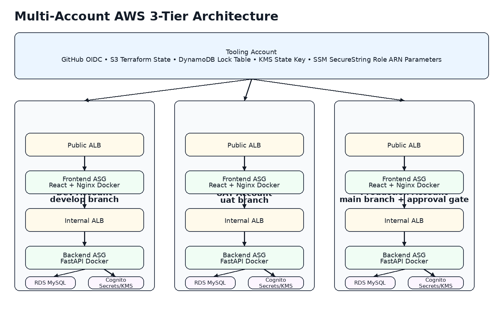
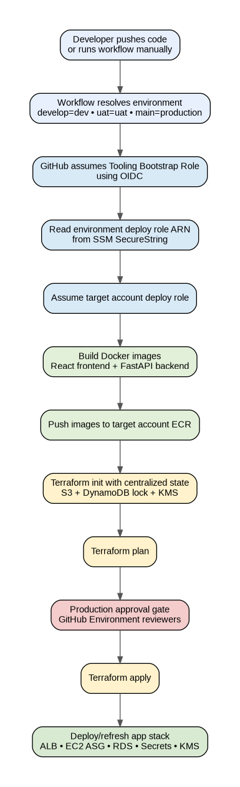
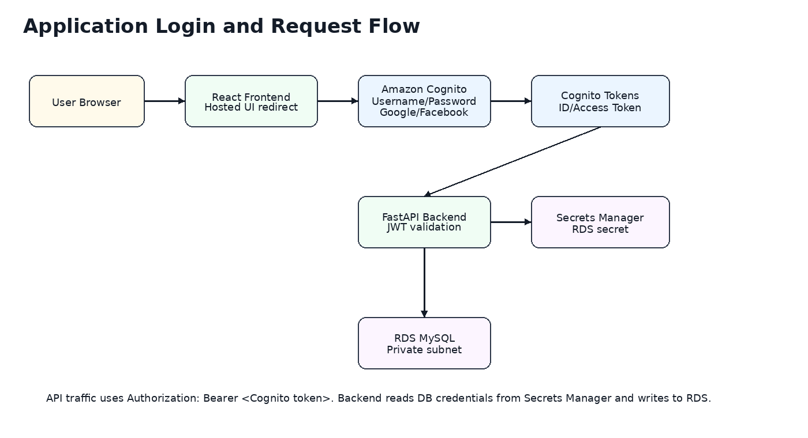

# AWS Multi-Account 3-Tier Application - No Cognito

This project deploys a secure, scalable, multi-account AWS 3-tier application using **Terraform**, **GitHub Actions**, **Docker**, **EC2 Auto Scaling Groups**, **Application Load Balancers**, **Amazon RDS MySQL**, **ACM**, **Route 53**, **AWS Secrets Manager**, **SSM Parameter Store**, and **KMS encryption**.

This version **does not use Amazon Cognito**. Authentication is handled by the application backend using local username/password accounts stored in RDS MySQL.

## Authentication Design

Users create an account directly in the application:

```text
User Browser
  |
  v
React Login/Register Form
  |
  | POST /api/auth/register or /api/auth/login
  v
FastAPI Backend
  |
  | Hashes passwords with bcrypt
  | Stores users in RDS MySQL
  | Issues application JWT
  v
RDS MySQL
```

FastAPI protects API routes using JWT bearer tokens:

```http
Authorization: Bearer <application-jwt>
```

The JWT signing secret is generated by Terraform and stored in AWS Secrets Manager with KMS encryption.

## Application URLs

| Environment | Public URL |
|---|---|
| Dev | `https://app.dev.mydevopsprojects.shop` |
| UAT | `https://app.uat.mydevopsprojects.shop` |
| Production | `https://app.mydevopsprojects.shop` |

## Architecture Diagram



## Deployment Flow Diagram



## Application Request Flow Diagram



## High-Level Architecture

```text
GitHub Actions
  |
  | OIDC authentication
  v
Tooling Account
  |
  | Central Terraform state
  | Bootstrap role
  | SSM SecureString deploy role ARN parameters
  v
Dev / UAT / Production Accounts
  |
  | Environment deploy roles
  | ECR repositories
  | VPC, ALB, ASG, RDS, KMS, ACM, Route 53, Secrets Manager
  v
3-Tier Application
```

## Environment VPC Design

Terraform creates a separate VPC for each environment in `us-east-1`. Availability Zones are selected dynamically using the AWS `aws_availability_zones` data source.

| Environment | VPC Name | CIDR |
|---|---|---|
| Dev | `vpc-dev` | `10.20.0.0/16` |
| UAT | `vpc-uat` | `10.10.0.0/16` |
| Production | `vpc-production` | `10.30.0.0/16` |

Each VPC contains:

```text
3 public subnets
3 private frontend subnets
3 private backend subnets
3 private database subnets
Internet Gateway
NAT Gateways
Route tables and route associations
```

## HTTPS and DNS

Terraform creates ACM certificates and validates them using Route 53 DNS validation. The public ALB listens on HTTPS port 443. HTTP port 80 redirects to HTTPS.

| Environment | DNS Record |
|---|---|
| Dev | `app.dev.mydevopsprojects.shop` |
| UAT | `app.uat.mydevopsprojects.shop` |
| Production | `app.mydevopsprojects.shop` |

## Application Tiers

### Frontend

- React.js
- Nginx
- Docker
- EC2 Auto Scaling Group
- Public ALB over HTTPS

### Backend

- Python FastAPI
- Gunicorn/Uvicorn
- Docker
- EC2 Auto Scaling Group
- Internal ALB
- Reads DB and JWT secrets from AWS Secrets Manager

### Database

- Amazon RDS MySQL
- Private database subnets
- RDS-managed master password in AWS Secrets Manager
- KMS encryption
- Automated backups
- Multi-AZ for production

## Local Authentication API

### Register

```http
POST /api/auth/register
```

```json
{
  "name": "John Doe",
  "email": "john@example.com",
  "password": "StrongPassword123!"
}
```

### Login

```http
POST /api/auth/login
```

```json
{
  "email": "john@example.com",
  "password": "StrongPassword123!"
}
```

### Current User

```http
GET /api/me
Authorization: Bearer <application-jwt>
```

## Backend Database Table

FastAPI initializes this table on startup:

```sql
CREATE TABLE IF NOT EXISTS users (
    id INT AUTO_INCREMENT PRIMARY KEY,
    email VARCHAR(255) NOT NULL UNIQUE,
    name VARCHAR(255) NOT NULL,
    password_hash VARCHAR(255),
    is_active BOOLEAN DEFAULT TRUE,
    created_at TIMESTAMP DEFAULT CURRENT_TIMESTAMP,
    updated_at TIMESTAMP DEFAULT CURRENT_TIMESTAMP ON UPDATE CURRENT_TIMESTAMP
);
```

## Secrets Management

The database password is managed by RDS and stored in AWS Secrets Manager:

```hcl
manage_master_user_password   = true
master_user_secret_kms_key_id = var.kms_key_arn
```

Terraform also creates an application JWT secret:

```text
three-tier-app-<environment>/auth/app-jwt
```

The backend receives:

```text
DB_SECRET_ARN
APP_JWT_SECRET_ARN
APP_JWT_ALGORITHM
APP_JWT_EXPIRE_MINUTES
```

## Repository Structure

```text
.
├── frontend/
│   ├── Dockerfile
│   ├── nginx.conf.template
│   ├── package.json
│   └── src/
│       └── main.jsx
├── backend/
│   ├── Dockerfile
│   ├── requirements.txt
│   └── main.py
├── terraform/
│   ├── tooling/
│   ├── bootstrap/
│   ├── modules/
│   │   ├── acm/
│   │   ├── alb/
│   │   ├── asg/
│   │   ├── kms/
│   │   ├── network/
│   │   ├── rds/
│   │   ├── route53/
│   │   ├── route53-records/
│   │   └── security-groups/
│   └── environments/
│       ├── dev/
│       ├── uat/
│       └── production/
├── .github/workflows/
│   ├── tooling-foundation.yml
│   ├── bootstrap-multi-account.yml
│   └── app-deploy.yml
└── README.md
```

## Branch Deployment Flow

| Branch | Environment | Target Account |
|---|---|---|
| `develop` | Dev | Dev account |
| `uat` | UAT | UAT account |
| `main` | Production | Production account |

Production uses a GitHub Environment approval gate before `terraform apply`.

## Deployment Order

```text
1. Run Tooling Foundation workflow
2. Run Bootstrap Multi-Account workflow
3. Push to develop for dev deployment
4. Merge develop to uat for UAT deployment
5. Merge uat to main for production deployment
```

## Required GitHub Variables

```text
AWS_REGION=us-east-1
PROJECT_NAME=three-tier-app
TOOLING_ACCOUNT_ID=111111111111
DEV_ACCOUNT_ID=222222222222
UAT_ACCOUNT_ID=333333333333
PRODUCTION_ACCOUNT_ID=444444444444
GITHUB_ORG=your-github-username-or-org
GITHUB_REPO=your-repo-name
BOOTSTRAP_ROLE_ARN=arn:aws:iam::111111111111:role/three-tier-app-github-actions-bootstrap-role
TF_STATE_BUCKET=three-tier-app-terraform-state-111111111111
TF_LOCK_TABLE=three-tier-app-terraform-locks
TF_STATE_KMS_KEY_ID=alias/three-tier-app-tooling-state-kms
FRONTEND_REPOSITORY_NAME=react-frontend
BACKEND_REPOSITORY_NAME=fastapi-backend
TERRAFORM_VERSION=1.9.0
```

There are no Cognito-related GitHub variables or secrets in this version.

## Security Controls

- No Cognito dependency
- Local account registration and login handled by FastAPI
- Passwords hashed with bcrypt before storage
- JWT signing key generated by Terraform and stored in Secrets Manager
- RDS master password generated and managed by RDS in Secrets Manager
- KMS encryption for secrets, RDS, EBS, ECR, logs, SSM, and Terraform state
- HTTPS using ACM and Route 53 DNS validation
- HTTP to HTTPS redirect
- Private backend ALB
- Private RDS database
- GitHub OIDC instead of long-lived AWS keys after bootstrap
- Production approval gate

## Useful Endpoints

```text
GET  /
GET  /health
POST /api/auth/register
POST /api/auth/login
GET  /api/me
GET  /api/users
POST /api/users
```

## Final Summary

This version deploys a secure AWS multi-account 3-tier application without Cognito. Terraform creates networking, DNS, ACM certificates, ALBs, EC2 Auto Scaling Groups, RDS MySQL, Secrets Manager secrets, and KMS encryption. The React frontend provides local sign-up and sign-in forms. The FastAPI backend hashes passwords, stores users in RDS MySQL, issues JWT tokens, and protects API endpoints with bearer-token authentication.
